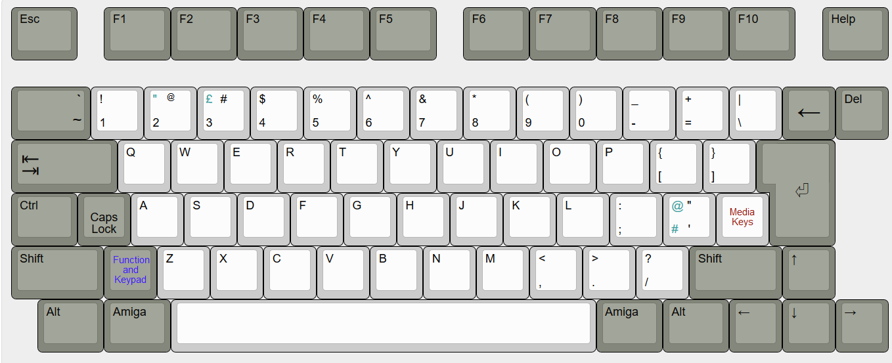
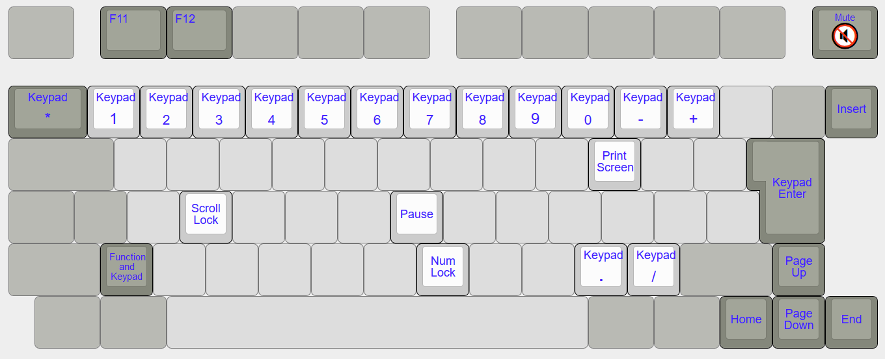
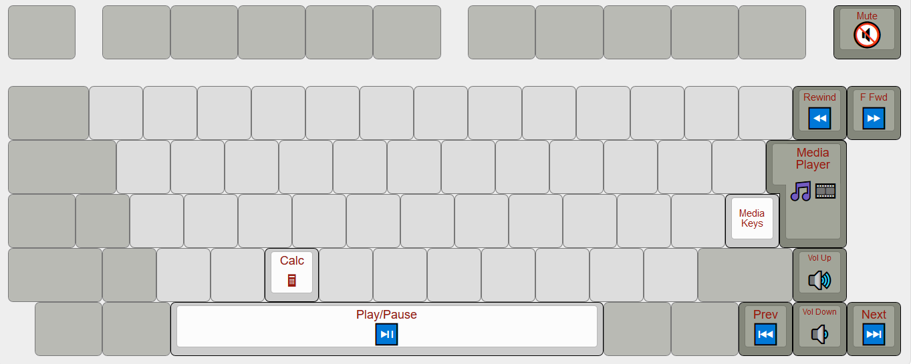

# Amiga 600
This project enables an existing Amiga 600 Keyboard to operate as a USB Keyboard.

Keyboard Maintainer:  https://github.com/thinghacker
Supported Hardware: [Amiga 600 USB Keyboard Adapter](https://github.com/thinghacker/amiga600_usb_pcb)

### Features

- Based on QMK Firmware and Teensy++ 2.0, this can be modified
- Uses the Amiga 600 case LEDs for Power / Number Lock and Scroll Lock
- For the English keyboard variant, the two blank "International" keys shift layers to support more contemporary functions such as F11, F12, Numeric Keypad and Media Keys
- [Uses a simple PCB Design](https://github.com/thinghacker/amiga600_usb_pcb "Uses a simple PCB Design") with a small number of components

### Build Instructions
```
    make amiga600:default
```

See [build environment setup](https://docs.qmk.fm/build_environment_setup.html) then the [make instructions](https://docs.qmk.fm/make_instructions.html) for more information.

### Keyboard Layer Configuration

Base Layer


Additional Function Keys and Numeric Keypad Layer


Media Keys Layer


No claims to the name or any trademarks associated with Amiga are asserted here
